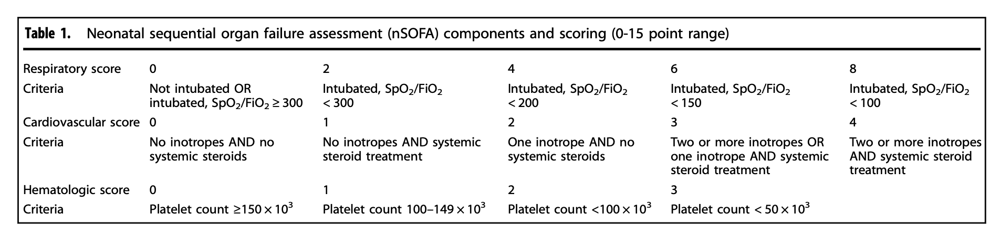

# Neonatal Sequential Organ Failure Assessment (nSOFA) Calculation

The nSOFA is an objective, operational definition of organ dysfunction that can successfully identify the risk of mortality among very low birth weight infants with late-onset infection (PMID: 31394566). The nSOFA utilizes categorical scores (total score range 0–15) to objectively describe dynamic changes in: (1) the need for mechanical ventilation and oxygen requirement to maintain a physiologic peripheral saturation (score range 0–8), (2) the need for inotropic support including the use of corticosteroid support (for presumed adrenal insufficiency or catecholamine-resistant shock) (score range 0–4), and (3) the presence and degree of thrombocytopenia (score range 0–3). Medications considered as vasoactive or inotropic included dopamine, dobutamine, epinephrine, norepinephrine, vasopressin, milrinone, and phenylephrine.

## Requirements

The following packages are needed to run the scripts: 

    tidyverse
    vroom
    janitor
    lubridate
    here
    openxlsx
    readxl
   
__Note The dependency management system [renv](https://rstudio.github.io/renv/articles/renv.html) is used to ensure the packages and their required dependencies are installed.__

## About the Data 
The data was acquired from the University of Florida Integrated Data Repository (IDR) under the aegis of IRB #201902780. The principal investigator on this IRB is James L Wynn, MD. The data sets are exports from the IDR's Epic Clarity system.

To use the data, download the files in [`https://www.dropbox.com/sh/z3yabq5vmvptoq7/AABmmkYWXqIWQRx_JLVfSlIMa?dl=0`](https://www.dropbox.com/sh/z3yabq5vmvptoq7/AABmmkYWXqIWQRx_JLVfSlIMa?dl=0) and [`https://www.dropbox.com/s/d7lu2942ig5jb0r/categorized_respiratory_devices.xlsx?dl=0`](https://www.dropbox.com/s/d7lu2942ig5jb0r/categorized_respiratory_devices.xlsx?dl=0) and copy into the data folder. If you do not have access to the dropbox folder, please request access from [pbc@ufl.edu](mailto:pbc@ufl.edu),  [lawjames1@ufl.edu](mailto:lawjames1@ufl.edu) or [james.wynn@peds.ufl.edu](mailto:james.wynn@peds.ufl.edu).

## Current Scripts
- [`functions.R`](functions.R): contains the data transformation functions used to create the nsofa components

- [`make_nsofa_dataset.R`](make_nsofa_dataset.R): creates a dataset of q1hr nsofa scores and a dataset of the max nsofa score within n days of birth

- [`count_and_categorize_respiratory_devices.R`](count_and_categorize_respiratory_devices.R): created the initial version of `categorized_respiratory_devices.xlsx`. This file is used to categorize respiratory devices as indicating that a child is intubated or _not_ intubated. The version of `categorized_respiratory_devices.xlsx` used in these calculation was reviwed and updated by James Wynn.

## Score Calculation

